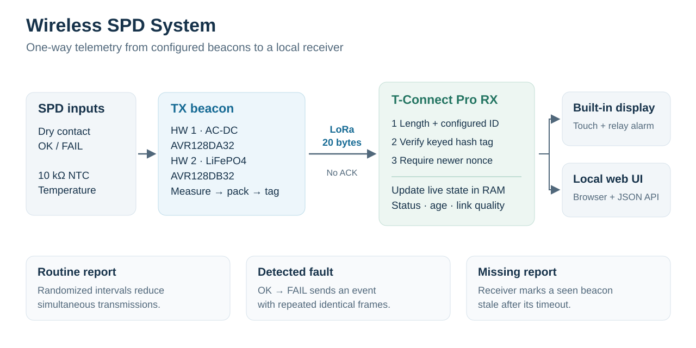
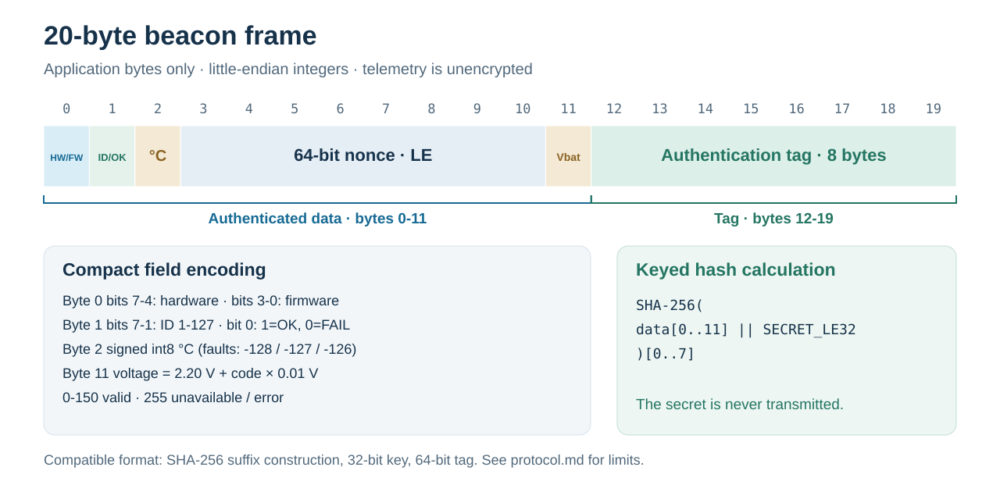

# Radio protocol

Both beacon hardware versions use the same 20-byte application frame. Each beacon has a unique ID (1-127) and a private 32-bit key; the receiver is configured with the same ID/key pair. The receiver can configure up to 127 wireless beacons plus one optional local wired SPD. Its LCD shows eight rows per page at the configured `DISPLAY_PAGE_SECONDS` interval (default five seconds) when multiple pages are needed. Reception, alarms, the web dashboard and one `GET /api/v1/get` response cover all configured SPDs. Receiver release `v0.1-tconnpro` is separate from the beacon HW/FW packet fields.

The beacon sends randomized routine reports and an event when a sampled SPD contact changes from OK to FAIL. Fault events repeat the identical frame to improve delivery; there is no acknowledgement. Battery hardware samples the contact every 60 seconds by default, so fault detection can take one sampling interval. A manual button requests a report.

## Frame

| Offset | Bytes | Encoding |
| --- | ---: | --- |
| 0 | 1 | `(hardware << 4) \| firmware`; hardware 1 = AC-DC, 2 = battery. Each value is a 4-bit nibble. |
| 1 | 1 | `(ID << 1) \| status`; status 1 = contact closed / OK, 0 = open / FAIL. |
| 2 | 1 | Signed `int8` temperature in °C; default fault sentinels: -128 ADC error, -127 open NTC, -126 short NTC. The current receiver displays these numeric values. |
| 3-10 | 8 | Unsigned 64-bit event counter (called nonce), little-endian. |
| 11 | 1 | Cell voltage: `2.20 + code × 0.01` V; battery TX emits 0-150 (2.20-3.70 V), clamping outside that range. `255` = unavailable/error (always used by AC-DC hardware). Codes 151-254 are reserved by TX; current RX still decodes them numerically. |
| 12-19 | 8 | First 8 digest bytes of `SHA256(frame[0:12] \|\| secret_le32)`. |

`||` means byte concatenation; `secret_le32` is the four key bytes, least significant byte first. There is no packet timestamp, encryption, or separate protocol-version field. The hardware/firmware byte identifies the sender implementation.

## Authentication and freshness

The hash tag binds the ID, status, measurements, and counter to the private key. An unconfigured ID or incorrect tag is rejected before live state changes. This prevents a beacon with a different key from simply impersonating a configured ID. The key stays on the beacon and receiver and must never enter Git history.

This existing compatibility format is **not HMAC** or a public-key signature. Its key is only 32 bits: a captured valid frame permits offline testing of at most `2^32` candidate keys. The 8-byte tag does not provide 64-bit key strength. Use unique keys per beacon; a future stronger format should use a standard MAC and a larger key. LoRa CRC detects transmission errors and the sync word separates traffic; neither authenticates a sender.

The receiver accepts a counter only when it is greater than the last accepted value for that ID. Repeated fault frames are accepted only if an earlier copy was missed. Both beacon hardware versions at firmware 1 commit the next nonce to EEPROM before transmitting and resume from that value after power loss. A blank journal starts at 1, or at a configured migration value above the receiver's remembered nonce. See [persistent nonce and upgrade notes](nonce-storage.md). Receiver state is held in RAM and clears after its own restart; the receiver's replay history does not survive a receiver reboot.

The receiver keeps latest telemetry and a rolling loss window in RAM, marks previously seen beacons stale after the configured timeout, and presents the data on the screen and local HTTP interface. There is no persistent packet archive or external notification service in this firmware. Configure the stale timeout longer than the largest beacon interval. Unknown/stale states do not activate the relay alarm in the current implementation.

All devices must match frequency, spreading factor, bandwidth, coding rate, sync word, preamble, and CRC. Repository templates share 865.3 MHz, SF10, 125 kHz bandwidth, coding rate 4/5, sync word 0x12, preamble 8, and 2-byte CRC; see the [setup guide](../README.md). Choose channel, power, and reporting interval for the applicable local radio rules.

The SVG images are editable vector sources. Regenerate them with `python3 tools/generate_diagrams.py` from the repository root.
