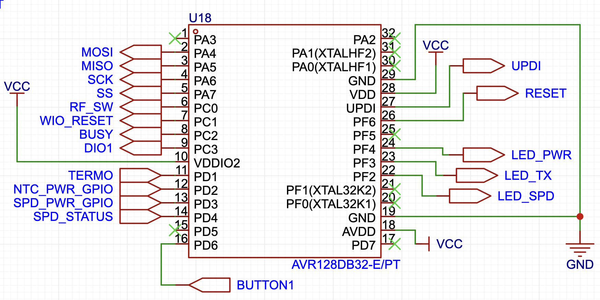

# Beacon hardware

| Version | Supply / MCU | Drawing |
| --- | --- | --- |
| [1 · AC-DC](ac-dc/README.md) | IRM-02-3.3 / AVR128DA32-E/PT | [Original schematic, SVG](ac-dc/schematic.svg), [PNG preview](ac-dc/schematic-preview.png) |
| [2 · Battery](battery/README.md) | LiFePO4 cell / LM66100 / AVR128DB32-E/PT | [Full schematic with MCU update, PDF](battery/schematic-revised.pdf), [supplied MCU update](battery/mcu-pin-map-revised.png) |

Both use a Wio-SX1262 module, an SPD dry-contact input, and a 10 kΩ NTC (nominal beta 3435 K). The AC-DC PNG is a browser-rendered preview of the unchanged SVG; it avoids CSS-variable rendering issues in some SVG viewers.

The battery full schematic applies the supplied update by replacing the MCU section only; the remaining circuit is retained from the original drawing. Its MCU mapping matches the supported firmware: SPD_STATUS=PD4, BUTTON1=PD6, LEDs=PF4/PF3/PF2. The [original PDF](battery/schematic-v1.0-original.pdf) and MCU screenshot are preserved as source references.

| Signal | AC-DC · AVR128DA32 | Battery · AVR128DB32, revised |
| --- | --- | --- |
| MOSI / MISO / SCK / NSS | PA4 / PA5 / PA6 / PA7 | PA4 / PA5 / PA6 / PA7 |
| RF switch / radio reset / BUSY / DIO1 | PC0 / PC1 / PC2 / PC3 | PC0 / PC1 / PC2 / PC3 |
| SPD status | PD7 | PD4 |
| Thermistor | PD0 | PD1 |
| NTC divider power / SPD divider power | Always supplied | PD2 / PD3 |
| Manual report button | None | PD6, active low |
| Power / TX / SPD LED | PA1 / PF5 / PF4 | PF4 / PF3 / PF2, active low |
| Programming | UPDI (MCU pin 27), GND, target VCC | UPDI (MCU pin 27), GND, target VCC |

The supplied drawings show the same four-pin programming header numbering:

| Hardware / drawing | Pin 1 | Pin 2 | Pin 3 | Pin 4 |
| --- | --- | --- | --- | --- |
| AC-DC · original SVG | RESET | VCC | GND | UPDI |
| Battery · full schematic with MCU update | RESET | VCC | GND | UPDI |

Check actual connector orientation and continuity before connection. The battery programming header is retained from the full drawing, outside the MCU replacement. UPDI is distinct from RESET (PF6, MCU pin 26). Supply pins are VDD 28, AVDD 18, GND 19/29; battery DB hardware also ties VDDIO2 pin 10 to VCC.

Use a programmer with target-compatible voltage, and only one supply source. AC-DC hardware is nominally 3.3 V; battery VCC follows the cell through the ideal-diode circuit. Bench-program AC-DC boards with mains disconnected and an isolated compatible low-voltage supply. Installation, mains isolation, and SPD wiring require appropriate electrical qualification. The firmware and these supplied drawings do not establish electrical safety or authorize energization.

The supplied drawings and AC-DC PCB render are reference exports. No editable EDA project, PCB layout source, Gerbers, BOM, or assembly files were provided for inclusion.
