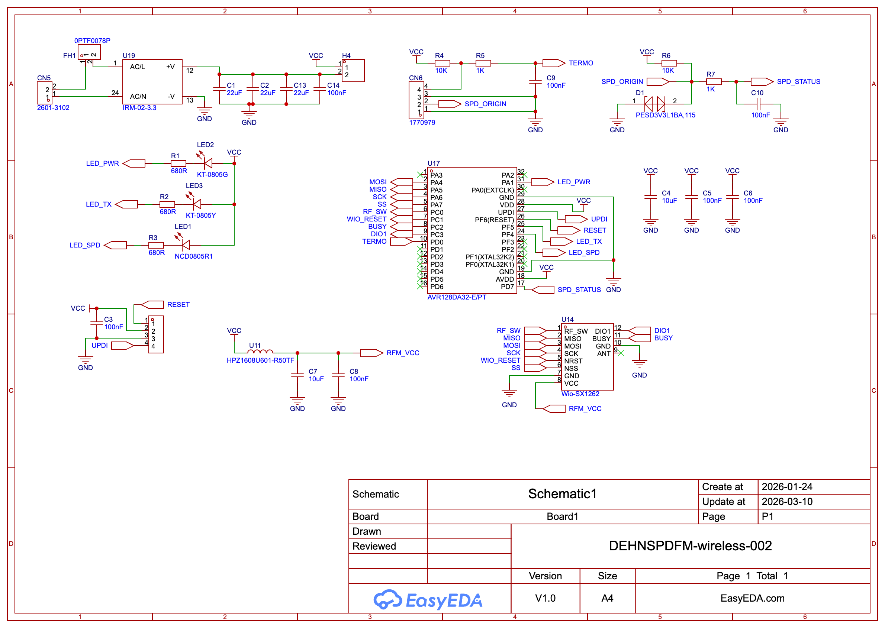

# Hardware 1 · AC-DC beacon

This transmitter monitors an SPD dry contact and a 10 kΩ NTC, then sends status and temperature to the receiver over LoRa. An **AVR128DA32-E/PT** runs the firmware, the **IRM-02-3.3** provides the nominal 3.3 V supply, and the **Wio-SX1262** handles the radio link.

Supplied PCB render of this hardware version.

- [Flashing instructions](../../docs/flashing.md)
- [Pin mapping and programming connections](../README.md)

## Compatible firmware

| Firmware version | Project | Features |
| --- | --- | --- |
| 1 | [acdc_avr128da32](../../firmware/beacons/acdc_avr128da32/README.md) | SPD status and temperature reports |

Versions above are the firmware IDs transmitted in beacon packets. Each compatible firmware version has its own row.

## Full schematic

[Download full schematic, SVG](schematic.svg) · [Open PNG preview](schematic-preview.png)

## Input fuse

If the expected input voltage exceeds **250 VDC**, fit a **5 × 20 mm fuse with an explicit DC voltage rating at least as high as the maximum input voltage**. Many common 5 × 20 mm fuses are rated 250 V; an AC rating alone does not establish suitability for DC. For example, **Littelfuse 0477.500MXP** is a 500 mA time-lag cartridge fuse rated **400 VDC / 500 VAC** ([manufacturer datasheet](https://www.littelfuse.com/assetdocs/fuse-477-datasheet?assetguid=624ac410-146d-47dc-9971-cdaaa78f2c78)). Select current rating, time characteristic and breaking capacity for the circuit; the fuse rating does not increase the converter's input-voltage limit.

## PCB fabrication files

[Download hardware 1 Gerbers ZIP](https://github.com/djeZo888/WirelessSPDSystem/raw/refs/heads/main/hardware/ac-dc/manufacturing/hw1-acdc-gerbers.zip)

The 34 × 75 mm board matches the PCB render, component placement and firmware pin mapping.
The ZIP contains eight Gerber layers and plated/nonplated drill files, preserved byte-for-byte.
Fabricator customer/order data and the duplicate via-only drill subset are omitted.
See [file list and verification notes](manufacturing/README.md).

Bench-program with mains disconnected and an isolated compatible low-voltage supply. Installation and mains wiring require appropriate electrical qualification.
