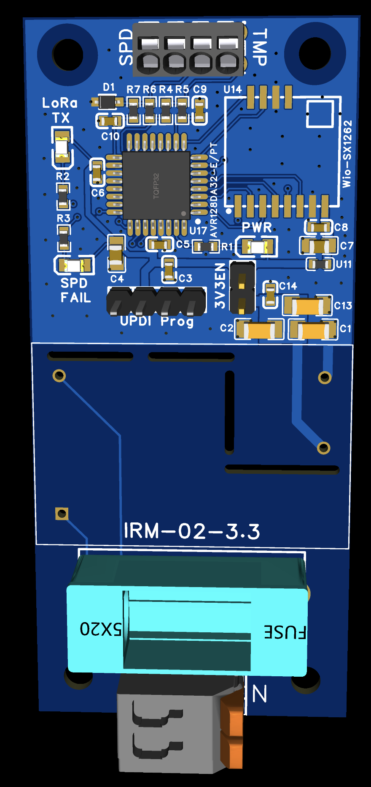

# Hardware 1 · AC-DC beacon

This transmitter monitors an SPD dry contact and a 10 kΩ NTC, then sends status and temperature to the receiver over LoRa. An **AVR128DA32-E/PT** runs the firmware, the **IRM-02-3.3** provides the nominal 3.3 V supply, and the **Wio-SX1262** handles the radio link.

Supplied PCB render of this hardware version.

- [Firmware and configuration template](../../firmware/beacons/acdc_avr128da32/)
- [Flashing instructions](../../docs/flashing.md)
- [Original schematic, SVG](schematic.svg) · [schematic PNG preview](schematic-preview.png)
- [Pin mapping and programming connections](../README.md)

## PCB fabrication files

[Download hardware 1 Gerbers ZIP](https://github.com/djeZo888/WirelessSPDSystem/raw/refs/heads/main/hardware/ac-dc/manufacturing/hw1-acdc-gerbers.zip)

The 34 × 75 mm board matches the PCB render, component placement and firmware pin mapping.
The ZIP contains eight Gerber layers and plated/nonplated drill files, preserved byte-for-byte.
Fabricator customer/order data and the duplicate via-only drill subset are omitted.
See [file list and verification notes](manufacturing/README.md).

Bench-program with mains disconnected and an isolated compatible low-voltage supply. Installation and mains wiring require appropriate electrical qualification.
