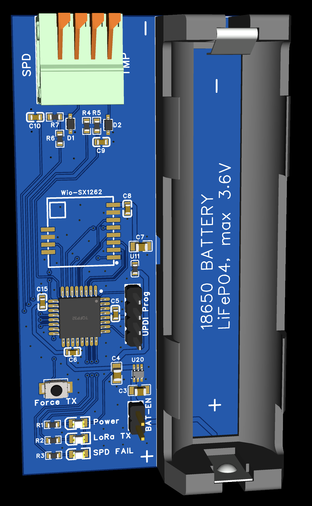
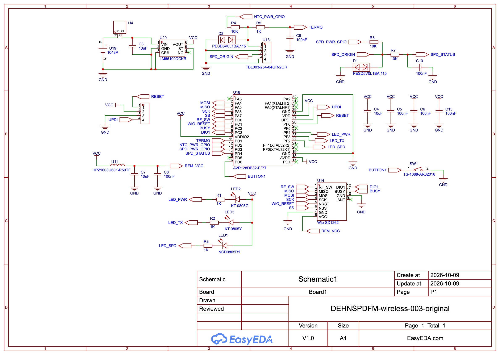

# Hardware 2 · Battery beacon

This transmitter monitors an SPD dry contact and a 10 kΩ NTC, then sends status, temperature, and cell voltage to the receiver over LoRa. An **AVR128DB32-E/PT** runs the firmware, an **18650-size LiFePO4 cell** supplies the board through an **LM66100** ideal-diode circuit, and the **Wio-SX1262** handles the radio link. The MCU sleeps between measurements; the button requests a report.

Recovered PCB render of the version supplied for PCB fabrication and SMT assembly.

- [Flashing instructions](../../docs/flashing.md)
- [Pin mapping and programming connections](../README.md)

Fit the BAT-EN jumper for operation. Use an 18650-size LiFePO4 cell with a maximum voltage of 3.6 V, as marked on the PCB; no charging circuit is shown.

## Compatible firmware

| Firmware version | Project | Features |
| --- | --- | --- |
| 0 | [battery_avr128db32](../../firmware/beacons/battery_avr128db32/README.md) | SPD status, temperature, cell voltage, sleep and button-triggered reports |

Versions above are the firmware IDs transmitted in beacon packets. Each compatible firmware version has its own row.

## Full schematic

[Download full schematic, SVG](schematic.svg) · [Open PNG preview](schematic-preview.png)

This recovered full drawing is the reference for hardware 2. It replaces the earlier partial drawings and combined PDF. MCU connections match the supported firmware: SPD_STATUS=PD4, BUTTON1=PD6, and power/TX/SPD LEDs=PF4/PF3/PF2.

## PCB fabrication files

[Download hardware 2 Gerbers ZIP](https://github.com/djeZo888/WirelessSPDSystem/raw/refs/heads/main/hardware/battery/manufacturing/hw2-battery-gerbers.zip)

The board matches the recovered PCB render, full schematic and firmware pin mapping.
The ZIP contains eight Gerber layers and plated/nonplated drill files, preserved byte-for-byte.
Fabricator customer/order data, reference drawings and the duplicate via-only drill subset are omitted.
See [file list and verification notes](manufacturing/README.md).
